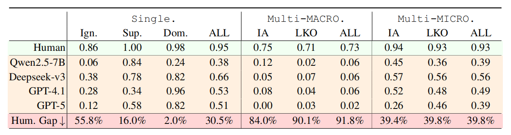

# How Does Personalized Memory Shape LLM Behavior? Benchmarking Rational Preference Utilization in Personalized Assistants


## Motivation Example
Different levels of PAs. In L1, memory is directly concatenated with the query, whereas in L2, the PA infers implicit cues from the user’s query to determine memory utilization strategy


## Performance
### Discriminative Setting
Performance of major LLMs on the discriminative intent matching accuracy in RPEval. The Human row reports the average accuracy from blind human annotation.


### Generative Setting
(a) Fine-grained Error Analysis; (b) Overall error severity in the generative setting with
the single-preference configuration, (c) the reliability of the LLM-as-a-judge evaluation.


## Dataset Files

The benchmark data is stored under `benchmark_dataset/`, and the data-generation pool is stored at `data_generation/data.json`.
Croissant metadata is provided in `croissant.json`.

```text
benchmark_dataset/
  explicit_preference/
    single_testset.json
    multi_testset.json
  implicit_preference/
    single_testset.json
    multi_testset.json
data_generation/
  data.json
croissant.json
```

## Dataset Statistics

RPEval distinguishes between query-level records and atomic preference-query annotations. A single-preference record contains one annotated preference for one query. A multi-preference record contains multiple preferences for the same query, with one utilization label per preference.

The released data-generation pool contains 756 query-level records and 8,567 atomic preference-query annotations:

| Split | Query-level records | Atomic annotations | Ignore | Support | Dominate |
| --- | ---: | ---: | ---: | ---: | ---: |
| Data generation pool | 756 | 8,567 | 4,330 | 2,237 | 2,000 |

The released evaluation benchmark contains explicit and implicit memory settings. Each setting has 300 query-level records and 953 atomic annotations:

| Evaluation setting | Single records | Multi records | Atomic annotations | Ignore | Support | Dominate |
| --- | ---: | ---: | ---: | ---: | ---: | ---: |
| Explicit memory | 150 | 150 | 953 | 691 | 129 | 133 |
| Implicit memory | 150 | 150 | 953 | 691 | 129 | 133 |

## Label Space

Single-preference files use textual labels:

- `ignore`: the preference should be ignored for the current query.
- `support` / `supportive`: the preference can support the response but should not dominate it.
- `dominate`: the response should strongly follow the preference.

Multi-preference files use compact per-preference labels in `intent_type`:

- `A`: Ignore
- `B`: Support
- `C`: Dominate

For multi-preference records, the `intent_type` string is aligned with the order of `persona`; for implicit-memory records, it is also aligned with `implicit_persona` and `reason`.

## Dataset Format

The dataset is provided in JSON format. Single-preference records contain one preference:

```json
{
  "persona": "用户平时注重身心放松，喜欢通过冥想等方式为自己营造安静舒缓的氛围，对各种助眠和自我安抚的小技巧总是抱有好奇心。",
  "question": "有没有适合学生宿舍的夜间放松小仪式，能让我晚上不那么焦虑？",
  "intent": "希望获得一些能在有限空间内操作、帮助缓解焦虑和放松身心的夜间小仪式，既能结合冥想，也愿意尝试其他简单易行的放松方法。",
  "intent_type": "supportive"
}
```

Multi-preference records contain multiple preferences:

```json
{
  "persona": [
    "用户习惯晚上活动较多，入睡时间比一般人要晚一些，觉得夜晚更安静自在。",
    "用户平时喜欢和家人一起参与各类文化体验活动，乐于在日常生活中为孩子寻找新鲜有趣的学习机会。",
    "用户极度反感人多和嘈杂的环境，尤其在出行安排上，绝不会选择任何热门、拥挤、需要排队或容易产生喧闹的地方。"
  ],
  "question": "我们准备国庆带孩子去成都周边玩几天，能帮忙设计个轻松点的行程吗？",
  "intent_type": "ABC",
  "reason": [
    "用户能够灵活调整作息以适应家庭需求。",
    "用户重视孩子的成长体验，倾向于选择文化类活动。",
    "用户对安静环境的需求非常突出。"
  ]
}
```

Implicit-memory files additionally include `implicit_persona`, which rewrites each explicit preference as a short dialogue history.

## Croissant Metadata

`croissant.json` describes the released JSON files, their checksums, file sizes, and record schemas. If you modify any dataset file, regenerate the checksums in `croissant.json` before submitting or releasing a new version.

## License

Code is released under the MIT License. Dataset files and Croissant metadata are released under CC BY-NC 4.0. See `LICENSE` for details.

## Benchmarking on RPEval

### Environment Setup

Create a conda environment:

```bash
conda create -n rpeval python=3.10 -y
conda activate rpeval
```

Install the required dependencies:

```bash
pip install -r requirements.txt
```

### API Configuration

All LLM calls use OpenAI-compatible interfaces. Configure model endpoints in `utils/api_config.json`.

For closed-source models, set the `base_url`, `api_key`, and `model_path` fields in `utils/api_config.json`. For open-source models, deploy an OpenAI-compatible local server, for example with `utils/vllm_deploy.sh`, and then point `base_url` to that server.

### Example Usage

The following scripts demonstrate the benchmark entry points. You can edit the variables inside each script to change the model key, memory setting, prompt type, thread count, or evaluation limit.

Benchmark discriminative single-preference tasks:

```bash
bash discrimation_task/single_intent.sh
```

Benchmark discriminative multi-preference tasks:

```bash
bash discrimation_task/multi_intent.sh
```

Benchmark generative single-preference tasks:

```bash
bash generation_task/single_intent.sh
```

Benchmark generative multi-preference tasks:

```bash
bash generation_task/multi_intent.sh
```
