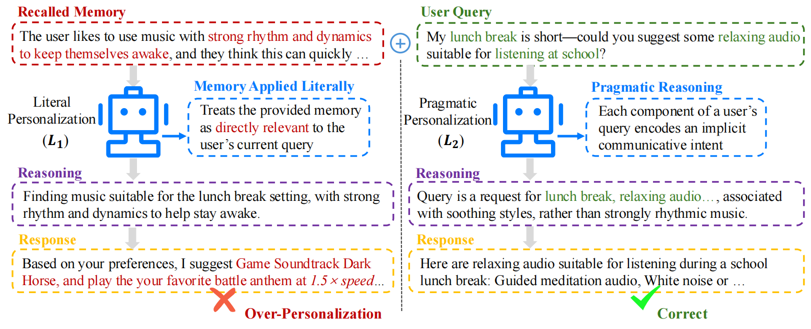
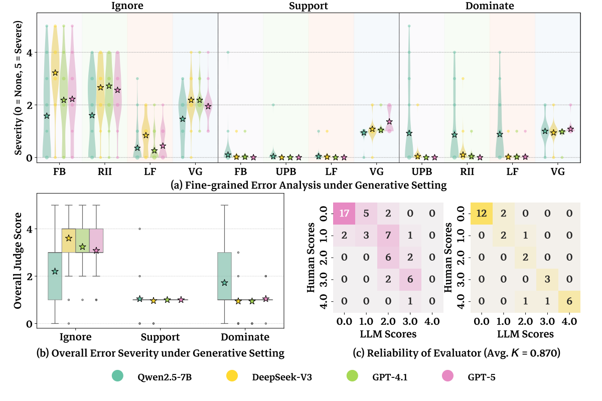

# RPEval: Benchmarking and Enhancing Rational Preference Utilization for Personalized Assistants: A Pragmatic View


## Motivation Example
Different levels of PAs. In L1, memory is directly concatenated with the query, whereas in L2, the PA infers implicit cues from the user’s query to determine memory utilization strategy


## Performance
### Discriminative Setting
Performance of major LLMs on the discriminative intent matching accuracy in RPEVAL. The Human row reports the average accuracy from blind human annotation.


### Generative Setting
(a) Fine-grained Error Analysis; (b) Overall error severity in the generative setting with
the single-preference configuration, (c) the reliability of the LLM-as-a-judge evaluation.


## Dataset Location
The dataset is provided in json format and contains the following attributes:

Explicit Preference:
<pre>
```json
{
  "name": "example",
  "version": "1.0.0",
  "description": "一个简单的示例"
}
```
</pre>


